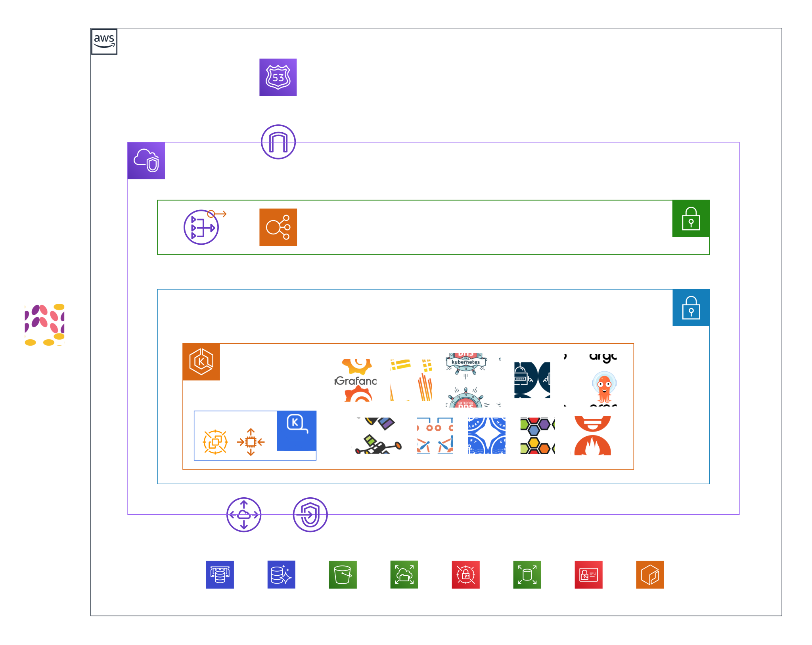

# SDP AWS

## Overview

**[READ THE BLOG for details](https://audacioustux.com/A-comprehensive-roadmap-to-Kubernetes-on-AWS-08fd3b83ff5f4d968629c8b546fdb5aa?pvs=4)**

### Components

- **Cilium**: for l3, l4, l7, and network policy enforcement - with Hubble, XDP, kube-proxy & vpc-cni replacement.
- **ExternalDNS**: for managing Route53 records.
- **ExternalSecrets**: for managing secrets from AWS Secrets Manager.
- **ArgoCD**: for GitOps and Self-healing for the other components.
- **KubePrometheus**: for monitoring and alerting.
- **Loki**: for log aggregation and querying. with Promtail, interated with Grafana.
- **Karpenter**: for autoscaling.
- **CertManager**: for managing certificates.
- **EBS CSI Driver**: for dynamic provisioning of Block Storage volumes.
- **EFS CSI Driver**: for dynamic provisioning of NFS volumes.
- **S3 Mount Driver**: for mounting S3 buckets as volumes.
- **Pod Identity Agent**: for IAM roles for pods.
- **Kyverno**: for policy enforcement.
- **Network Load Balancer**: for distributing traffic to the nodes.
- **Route53**: for DNS management.
- **VPC Gateway Endpoint**: for bypassing the NAT Gateway.
- **VPC Peering**: for connecting to other VPCs.
- **Pulumi**: for Infrastructure as Code.
